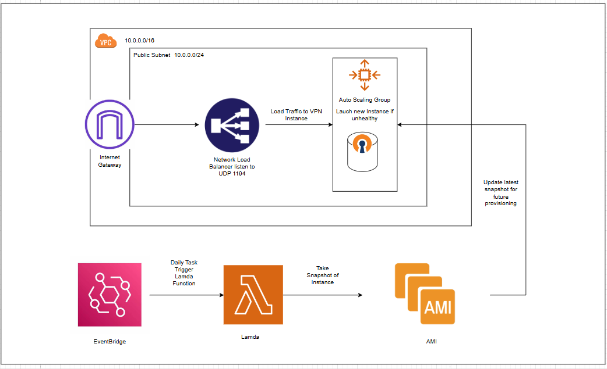

# SecureNet VPN Application

## Introduction

SecureNet VPN is a reliable and secure virtual private network (VPN) solution designed to provide users with enhanced privacy and data protection. It focuses on strong encryption standards, robust authentication mechanisms, and a user-friendly interface. Built to address the growing concerns over online security and privacy, SecureNet VPN integrates modern cryptographic protocols to secure communications and protect sensitive data during transmission.

This project is developed using **Node.js** for backend services and **Flutter** for the Android-based frontend, with **OpenVPN** as the primary protocol for VPN connections.

## Features

### 1. Secure VPN Protocols
SecureNet VPN implements **OpenVPN**, a widely used open-source VPN protocol known for its reliability, flexibility, and strong encryption. The application employs **AES-256-GCM** encryption for securing data transmission, ensuring both confidentiality and integrity.

### 2. Robust Authentication
The application uses **multi-factor authentication (MFA)** and **RSA encryption** for key exchange, providing an additional layer of security. This guarantees that only authorized users can access the VPN services, protecting sensitive user data from unauthorized access.

### 3. User-Friendly Interface
A key focus of SecureNet VPN is its intuitive and user-friendly interface. The Android application offers simple navigation and server selection options, making it easy for users to establish secure connections. The interface is optimized for a smooth user experience, regardless of technical expertise.

### 4. Enhanced Security Features
- **DNS Leak Protection**: Prevents the exposure of DNS requests outside the VPN tunnel.
- **IPV6 Support**: Ensures security across both IPV4 and IPV6 connections.
- **Kill Switch**: Automatically disconnects the internet if the VPN connection is lost, preventing data leakage.
- **Split Tunneling**: Enables selective routing of traffic outside the VPN for flexibility.

### 5. Server Configuration
SecureNet VPN supports **one-to-one mapping** for server connections, ensuring that only authenticated users can connect to the VPN servers. Each user is provided with a unique configuration file, preventing unauthorized usage.

## System Architecture

The system architecture is divided into three main components:
1. **Client Frontend (Android Application)**: A Flutter application that allows users to interact with the VPN services.
2. **Centralized Backend**: The backend is built using Node.js and handles user authentication, access control, and configuration management.
3. **VPN Server**: The VPN server, built on **OpenVPN**, is responsible for managing secure connections and tunneling user traffic.

## Tools & Technologies

- **Frontend**: Flutter
- **Backend**: Node.js
- **Protocols**: OpenVPN, AES-256-GCM encryption, RSA key exchange
- **Database**: MongoDB
- **Operating System**: Android (client), Linux (server)
- **Development Tools**: Visual Studio Code, Android Studio
- **Version Control**: Git
- **Deploy On**: Amazon Web Service

## PIC

#######################################################

# VPN Architecture Design

## Components

### 1. Virtual Private Cloud (VPC)
- **CIDR Range**: `10.0.0.0/16`
- **Public Subnet**: `10.0.0.0/24`
- **Internet Gateway**: Provides access to the internet for instances in the public subnet.

### 2. Network Load Balancer (NLB)
- **Purpose**: Acts as the entry point for VPN connections, distributing traffic to the VPN instance.
- **Configuration**:
  - **Protocol**: UDP
  - **Port**: 1194 (standard port for VPNs)
- **Benefits**:
  - Simplifies client configuration by providing a single access point.
  - No need to configure client devices with the VPN instance’s IP address. Clients only need the NLB endpoint.
  - Supports automatic failover by redirecting traffic to a new instance if the current VPN instance becomes unhealthy.

### 3. Auto Scaling Group (ASG)
- **Purpose**: Manages VPN instance lifecycle, ensuring availability and consistency.
- **Configuration**:
  - **Desired Capacity**: 1 instance (limited to one instance for data consistency)
  - **Health Check**: Automatically replaces the instance if it becomes unhealthy.
- **AMI**: The ASG launches instances based on the latest AMI created from daily snapshots, ensuring that any updates to the VPN server configuration are preserved.

### 4. Daily Snapshot and AMI Updates
- **EventBridge**: Schedules a daily event to trigger a Lambda function.
- **Lambda Function**: 
  - Takes a snapshot of the VPN instance daily.
  - Updates the latest AMI with the snapshot.
  - Ensures that the ASG always has an up-to-date AMI for provisioning new instances.
- **Benefits**:
  - Ensures configuration consistency across instances.
  - Maintains up-to-date VPN instance settings without manual intervention.

### 5. Data Consistency Strategy
- **Single Instance Setup**: The ASG is set to only maintain one instance at a time. 
- **Reason**: Hosting multiple VPN instances could lead to data inconsistency, as each instance would maintain its own CA and RSA certificates. By limiting the ASG to one instance, the VPN configuration remains consistent.
- **AMI Cloning**: New instances are cloned from the latest AMI, ensuring they have the exact configuration and certificate settings.

## Benefits of the Design
- **High Availability**: The ASG automatically replaces unhealthy instances, ensuring the VPN service is always accessible.
- **Consistency**: Using a single instance and cloning from daily AMIs ensures that every VPN instance is configured identically.
- **Simplified Client Configuration**: The NLB provides a consistent endpoint, so clients don’t need to be updated if the VPN instance changes.
- **Automatic Updates**: Daily snapshots and AMI updates ensure that the latest configuration is always used when launching a new instance.

## Diagram (for reference)

*Refer to the diagram for a visual overview of the architecture.*

---

## Summary of Workflow
1. **Traffic Entry**:
   - Clients connect to the NLB, which listens on UDP port 1194.
   - The NLB directs traffic to the VPN instance in the public subnet.

2. **Auto Scaling Group (ASG)**:
   - ASG maintains one instance, replacing it if it becomes unhealthy.
   - The instance is launched from the latest AMI created from daily snapshots.

3. **Daily Snapshot and AMI Update**:
   - EventBridge triggers a Lambda function daily.
   - Lambda function takes a snapshot of the VPN instance and updates the AMI.
   - Ensures consistency in VPN configuration across instance replacements.

---

## Key Points
- **NLB for Simplicity**: Load balancer provides a single entry point for VPN clients.
- **Single Instance for Consistency**: Prevents issues with different certificates by maintaining only one active VPN instance.
- **Automated Snapshot and AMI Update**: Ensures that all new instances are up-to-date with the latest VPN settings.

---

## Future Considerations
- **Logging and Monitoring**: Set up CloudWatch to monitor instance health, connection requests, and errors for better insight into the VPN’s performance.
- **Backup Strategy**: Consider additional backup mechanisms for the VPN configuration to prevent accidental loss of critical settings.
- **Scaling**: If future requirements need multiple VPN instances, explore options for synchronizing CA and RSA certificates across instances.

---

## AWS Services Used
- **VPC**: Network isolation and internet access.
- **Internet Gateway**: Allows internet traffic to the VPN.
- **Network Load Balancer**: Load balancing and single access point for VPN traffic.
- **Auto Scaling Group**: Manages VPN instance lifecycle, ensures single instance for consistency.
- **Lambda**: Executes daily snapshot tasks.
- **EventBridge**: Triggers Lambda on a schedule.
- **AMI**: Ensures consistent instance provisioning.

