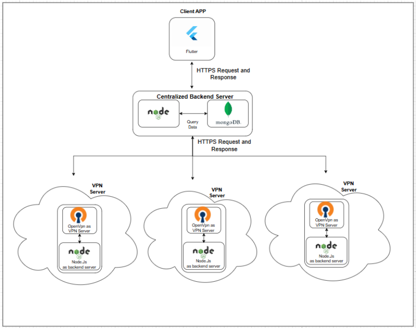
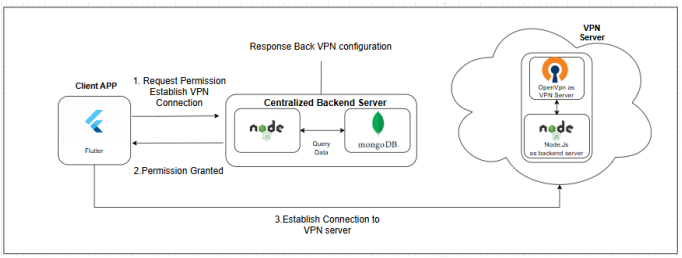
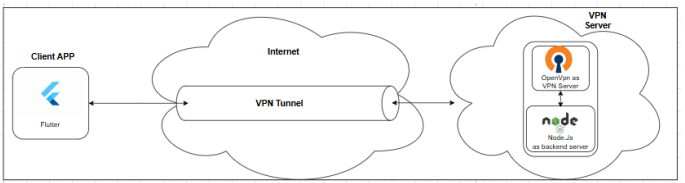

# SecureNet VPN Application

## Introduction

SecureNet VPN is a reliable and secure virtual private network (VPN) solution designed to provide users with enhanced privacy and data protection. It focuses on strong encryption standards, robust authentication mechanisms, and a user-friendly interface. Built to address the growing concerns over online security and privacy, SecureNet VPN integrates modern cryptographic protocols to secure communications and protect sensitive data during transmission.

This project is developed using **Node.js** for backend services and **Flutter** for the Android-based frontend, with **OpenVPN** as the primary protocol for VPN connections.

## Features

### 1. Secure VPN Protocols
SecureNet VPN implements **OpenVPN**, a widely used open-source VPN protocol known for its reliability, flexibility, and strong encryption. The application employs **AES-256-GCM** encryption for securing data transmission, ensuring both confidentiality and integrity.

### 2. Robust Authentication
The application uses **multi-factor authentication (MFA)** and **RSA encryption** for key exchange, providing an additional layer of security. This guarantees that only authorized users can access the VPN services, protecting sensitive user data from unauthorized access.

### 3. User-Friendly Interface
A key focus of SecureNet VPN is its intuitive and user-friendly interface. The Android application offers simple navigation and server selection options, making it easy for users to establish secure connections. The interface is optimized for a smooth user experience, regardless of technical expertise.

### 4. Enhanced Security Features
- **DNS Leak Protection**: Prevents the exposure of DNS requests outside the VPN tunnel.
- **IPV6 Support**: Ensures security across both IPV4 and IPV6 connections.
- **Kill Switch**: Automatically disconnects the internet if the VPN connection is lost, preventing data leakage.
- **Split Tunneling**: Enables selective routing of traffic outside the VPN for flexibility.

### 5. Server Configuration
SecureNet VPN supports **one-to-one mapping** for server connections, ensuring that only authenticated users can connect to the VPN servers. Each user is provided with a unique configuration file, preventing unauthorized usage.

## System Architecture

The system architecture is divided into three main components:
1. **Client Frontend (Android Application)**: A Flutter application that allows users to interact with the VPN services.
2. **Centralized Backend**: The backend is built using Node.js and handles user authentication, access control, and configuration management.
3. **VPN Server**: The VPN server, built on **OpenVPN**, is responsible for managing secure connections and tunneling user traffic.

## Tools & Technologies

- **Frontend**: Flutter
- **Backend**: Node.js
- **Protocols**: OpenVPN, AES-256-GCM encryption, RSA key exchange
- **Database**: MongoDB
- **Operating System**: Android (client), Linux (server)
- **Development Tools**: Visual Studio Code, Android Studio
- **Version Control**: Git
- **Deploy On**: Amazon Web Service

## PIC

